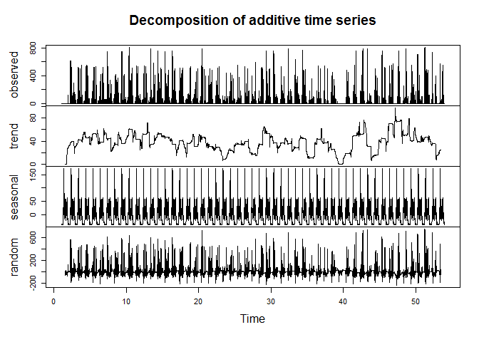

Assignment 1
=============


##Loading and preprocesing the data


```r
setwd("C:/Users/javzv_000/Documents/Curso R")
PAM=read.csv("activity.csv")
Steps=PAM[,1]
Days=PAM[,2]
Minutes=PAM[,3]
StepsNA=is.na(Steps)

## Cleaning Data

StepsT=Steps[!StepsNA]
DaysT=Days[!StepsNA]
MinutesT=Minutes[!StepsNA]
```


##What is mean total number of steps taken per day?


```r
DaysTN=as.numeric(DaysT)

j=1
dia=1
Contador=c(rep(0,60))
for(i in 1:60){
	if(DaysTN[j]==dia[1]){
		while(DaysTN[j]==dia[1]){
			Contador[i]=Contador[i]+StepsT[j]
			j=j+1
			if(j>15264){
			j=1
}
}	
}
else {
	Contador[i]=NaN
}
dia=dia+1
}

hist(Contador,main="Steps per Day",col="light green",xlab="Steps",nclass=15)
```

 

```r
summary(Contador)
```

```
##    Min. 1st Qu.  Median    Mean 3rd Qu.    Max.    NA's 
##      41    8841   10760   10770   13290   21190       7
```


##What is the average daily activity pattern?


```r
DFS=data.frame(Steps=StepsT)
TSsteps=ts(DFS,frequency=288)
# The reason for pick a 288 frequency is that this is the large of the day in
# minutes, this going to make a day patron in X-axys divide in 5 minutes
# intervals, and the number of steps in Y-axys
plot(TSsteps,type="l",col="light blue",xlab = "Days",ylab="Steps")
```

 

```r
DTSsteps=decompose(TSsteps)
plot(DTSsteps)
```

 

```r
#If you see the value of the random square you see that the error is bad
#but I will continue. (I can apply log to the data and see what happens)
#Cause I need the higher value in the seasonal plot I create it
plot(DTSsteps$seasonal,type="l",col="light blue",xlab = "Days",ylab="Steps")
```

 

```r
answer=c(rep(0,288))
for(i in 1:288){
	answer[i]=DTSsteps$seasonal[i]
}
plot(answer,type="l",lwd=0.5,col="light blue",xlab = "5 minutes Interval",ylab="Steps")
```

 

```r
max(answer)
```

```
## [1] 172.059
```

```r
which.max(answer)
```

```
## [1] 104
```

The answer to this question is 825, it's mean that at 1:50-1:55 pm the person walks a lot


##Imputing missing values


###Number of NA's

```r
x=Steps[StepsNA]
length(x)
```

```
## [1] 2304
```

if you divide this value by 288 it will result 8. 


###Fill the data

```r
Sum=c(rep(0,288))
for(w in 1:288){
j=w
while(j<length(StepsT)){
	Sum[w]=Sum[w]+StepsT[j]
	j=j+288	
}
}
means=ceiling(Sum/61)
means
```

```
##   [1]   2   1   1   1   1   2   1   1   0   2   1   1   1   1   1   1   0
##  [18]   1   2   1   1   1   1   0   0   0   1   0   0   1   0   1   0   0
##  [35]   2   1   0   0   0   0   1   1   2   1   1   1   0   0   2   1   3
##  [52]   0   1   1   4   1   4   1   3   1   0   2   3   2   3   3   2   6
##  [69]  14  16  35  39  28  43  47  56  44  41  46  35  39  39  33  43  39
##  [86]  39  44  48  44  45  49  39  46  61  51  49  64  60 113 137 149 136
## [103] 155 180 171 157 160 146 125 108  95  94  91  84  58  40  22  34  31
## [120]  19  36  24  37  46  34  45  39  33  31  25  22  28  28  26  19  23
## [137]  25  23  30  44  37  39  40  52  56  77  83  81  56  44  48  29  24
## [154]  33  40  59  37  35  38  36  41  50  38  22  35  47  42  53  49  46
## [171]  38  43  31  33  37  24  15  23  38  39  27  32  31  34  40  42  42
## [188]  57  73  86  89  73  54  56  65  55  50  52  39  34  39  40  41  38
## [205]  41  49  45  54  64  69  60  52  66  50  31  33  36  51  65  75  52
## [222]  59  68  65  75  87  76  75  74  68  51  47  32  18  24  35  27  23
## [239]  40  30  18  17  17  29  24  19  24  19  17  19  29  18  14  15  21
## [256]  17  11   7  13  15   8   7   8   3   2   4   5   8   7   8   9   2
## [273]   1   1   2   4   3   3   0   1   1   2   3   5   3   1   1   1
```

```r
for(i in 1:288){
j=i
valor=means[i]
	while(j<=length(Steps)){
		if(is.na(Steps[j])){
			Steps[j]=valor		
}
j=j+288
}
}
```


###Mean and Median

```r
DaysN=as.numeric(Days)
j=1
dia=1
Contador1=c(rep(0,61))
for(i in 1:61){
	#if(DaysN[j]==dia[1]){
		while(DaysN[j]==dia[1]){
			Contador1[i]=Contador1[i]+Steps[j]
			j=j+1
			if(j>17568){
			j=1
}
}	
dia=dia+1
}

par(mfrow=c(1,2),oma=c(0,0,2,0))
hist(Contador1,main="Steps per Day (fill)",col="light green",xlab="Steps",nclass=15)
hist(Contador,main="Steps per Day",col="light green",xlab="Steps",nclass=15)
mtext("Histogram of steps
 Comparation",outer=TRUE)
```

 

```r
summary(Contador1)
```

```
##    Min. 1st Qu.  Median    Mean 3rd Qu.    Max. 
##      41    9490   10400   10600   12810   21190
```

```r
summary(Contador)
```

```
##    Min. 1st Qu.  Median    Mean 3rd Qu.    Max.    NA's 
##      41    8841   10760   10770   13290   21190       7
```


In the histogram of the right you can see that the higher frequency is at the left of the middle, and in the other graph the higher frequency is in the right. You can say that includes this values modify the data and conclussions


##


```r
fecha=strptime(Days,"%Y-%m-%d")
semana=weekdays(fecha,abbreviate=FALSE)

vector1=c()
vector2=c()
for(i in 1:length(semana)){
if(semana[i]=="lunes"|semana[i]=="martes"|semana[i]=="miércoles"|semana[i]=="jueves"|semana[i]=="viernes"){
		vector1[i]=Steps[i]
		vector2[i]=i
}
}

weekend=is.na(vector1)

dds=Steps[!weekend]
mds=Minutes[!weekend]

ddb=Steps[weekend]
mdb=Minutes[weekend]

psdt=ts(dds,frequency=288)
dpsdt=decompose(psdt)
seasonal1=dpsdt$seasonal
ssdt=ts(ddb,frequency=288)
dssdt=decompose(ssdt)
seasonal2=dssdt$seasonal

answer2=c(rep(0,288))
for(i in 1:288){
	answer2[i]=dpsdt$seasonal[i]
}

answer3=c(rep(0,288))
for(i in 1:288){
	answer3[i]=dssdt$seasonal[i]
}

plot(answer2,type="l",xlab = "5 minutes interval",ylab ="Steps",main = "Week" ,col="gray")
```

 

```r
plot(answer3,type="l",xlab = "5 minutes interval",ylab ="Steps",main = "Weekends",col="orange")
```

 


